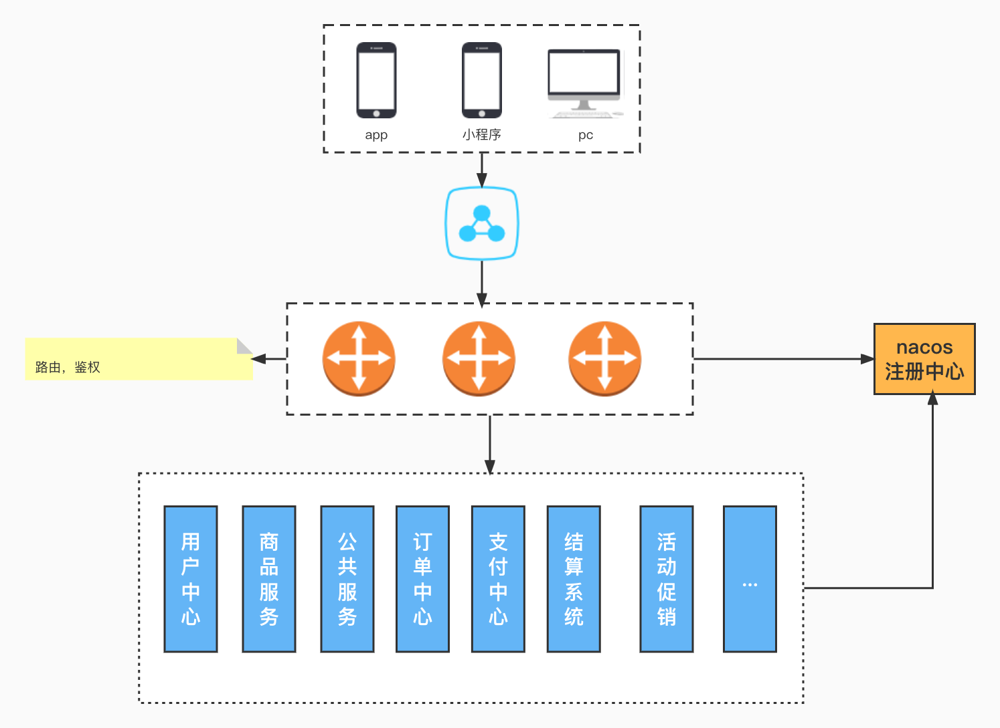
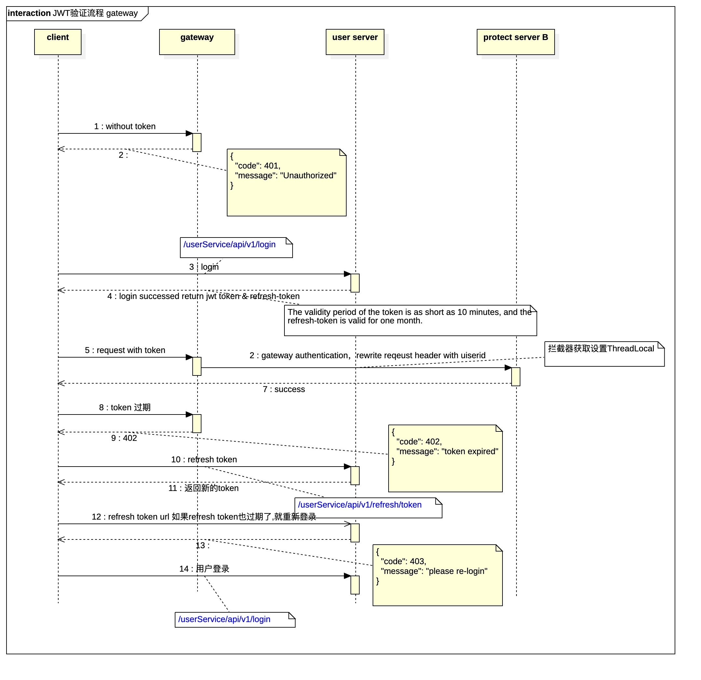

# 工程简介
基于spring cloud gateway，微服务网关，注册中心使用nacos, 具备微服务路由，jwt token鉴权功能[`CheckTokenFilter`](https://github.com/cws1981/springGateway/blob/main/src/main/java/com/shun/gateway/filter/CheckTokenFilter.java), 路径白名单配置。

